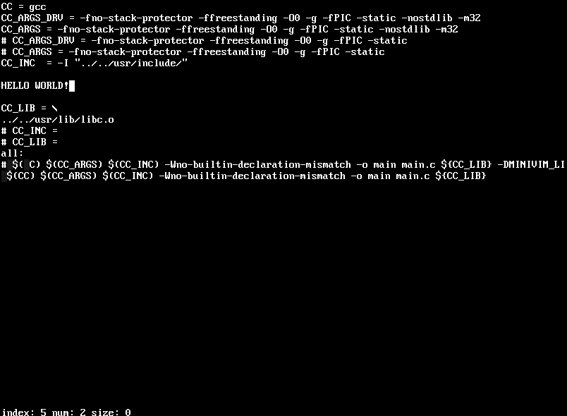

# MiniVim
Text editor for [Mountain Tech OS](https://mountaintech.ru/)

## Opportunities
- Support rows with 1000 bytes capacity
- 1000 Rows
- Without malloc, mmap
- Has three modes: viewing, light, full-support
- Can be easily improved (UTF-8 support, search, replace, permissions checks)
- ASCII support (Tab is not supported yet)
- Can EDIT!

## Modes

### Viewing
Compile without any defines.
You will only be able to view files

### Light
Compile with -DMINIVIM_FILESYSTEM flag.
You will be able to edit files!

### Full-support
Compile with -DMINIVIM_FILESYSTEM and -DMINIVIM_LINUX flags to see the full
power of this text editor

### TODO
- [ ] добавить обычное кч дерево для сдвигов вместо move(...). Можно декартоово.
- [ ] считать несколько строк как одну, чтоб не терять данные, когда строка больше 1000 символов
- [x] бинпоиск 
- [x] запись
- [x] чтение
- [ ] ??? деревья на строки что-ли ? 
